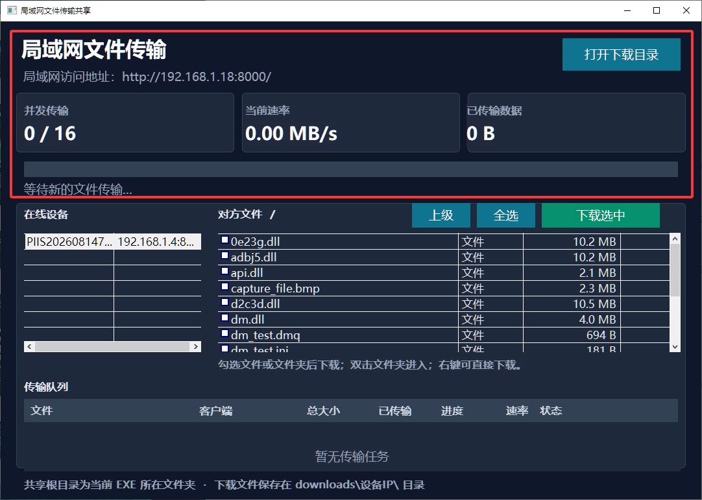

# LanHelper

局域网文件传输共享工具，使用原生 MFC 界面和 TCP 直接传输文件。



## 功能

- 默认共享当前 EXE 所在目录。
- 自动发现同一 `192.168.*.*` 网段内运行 LanHelper 的设备。
- 软件内浏览对方目录，支持进入文件夹、返回上级和批量勾选。
- 支持右键下载、全选下载和文件夹下载。
- 文件夹下载不创建 ZIP，直接并发传输原始文件并保留目录结构。
- 传输面板显示总大小、已传输大小、进度和 MB/s 速率。
- 深色 MFC 界面，下载文件保存到 `downloads\\设备IP\\`。

## 运行

直接运行仓库根目录的 [`LanHelper.exe`](LanHelper.exe)。

共享服务使用 TCP `8000` 端口，设备发现使用 UDP `48765` 端口。Windows 防火墙提示时，请允许局域网访问。

## 从源码编译

环境要求：Visual Studio 2019、C++ 桌面开发组件、MFC 和 x64 工具链。

```bat
build_mfc.bat
```

脚本会结束旧的 `LanShareMfc.exe`/`http_server.exe` 进程，并生成 `bin\\x64\\Release\\LanShareMfc.exe`。仓库根目录的 `LanHelper.exe` 是已编译好的可运行成品。

## 项目结构

- `http_server.cpp`：MFC 界面、局域网发现、HTTP 文件服务和并发下载。
- `LanShareMfc.vcxproj`：Visual Studio 工程文件。
- `build_mfc.bat`：结束旧进程并编译 Release x64 版本。
- `docs/lan-share-ui.png`：界面截图。

## 作者与交流

- 作者：Peanut Soft
- QQ：245867
- 交流 QQ 群：1103426302（[点击加入](https://qm.qq.com/q/Fv9KjpGCEq)）
